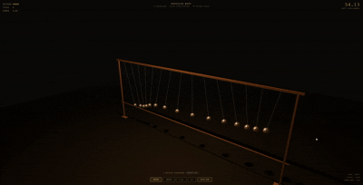

# Pendulum Wave

A 3D physics simulator faithful to the Harvard pendulum wave demonstration — 15 pool balls on strings of precisely calculated lengths, released together, forming emergent wave patterns that resolve back to perfect alignment every 60 seconds.

No dependencies. No build step. Pure HTML, CSS, and JavaScript.

**[Live Demo](https://jkh2.github.io/pendulum-wave/)**

---



---

## What Is a Pendulum Wave?

A pendulum wave is one of the most beautiful demonstrations in classical physics. A set of pendulums — each a slightly different length — are released simultaneously. Because each pendulum completes a different number of oscillations per unit time, they drift apart and back together in patterns that look coordinated but are entirely emergent.

There is no communication between the pendulums. Each one is a mass on a string obeying Newton. The wave is a property of the **spacing between their frequencies**, not of the pendulums themselves.

The governing equation is the simple pendulum period:

```
T = 2π√(L/g)
```

Each pendulum length is chosen so it completes exactly **n** full oscillations in the cycle time:

```
L = g · (T_cycle / n)² / (4π²)
```

The angular position at any time t, with optional damping:

```
θ(t) = A · e^(−bt) · cos(ωt)     where ω = 2πn / T_cycle
```

---

## The Harvard Specification

| Parameter | Value |
|---|---|
| Pendulums | 15 |
| Oscillations (min) | 51 per 60 seconds |
| Oscillations (max) | 65 per 60 seconds |
| Cycle time | 60 seconds |
| Amplitude | 15° |

### Pattern Timeline

| Time | Pattern |
|---|---|
| 0s | All aligned — released together |
| ~7s | Snake — traveling wave forms |
| ~15s | Split wave — two groups moving in opposite directions |
| ~20s | 3-group — three clusters emerge |
| ~30s | Anti-phase — maximum disorder |
| ~45s | Patterns retrace in reverse |
| 60s | **Realignment** — every pendulum back in phase |

The simulator detects and labels each pattern in real time.

---

## The 3D Approach

The simulation renders a faithful physical apparatus in three dimensions — wooden crossbeam, leg posts, strings, and pool balls — lit with warm overhead lighting and a reflective floor. An orbit camera lets you inspect the wave patterns from any angle, revealing depth and height relationships that a flat view can't show.

The wooden frame, warm overhead lighting, and pool-ball geometry are faithful to the physical apparatus.

---

## Controls

### Camera
| Control | Function |
|---|---|
| Left drag | Orbit camera |
| Right drag | Pan |
| Scroll | Zoom |
| Auto Cam | Cinematic slow orbit |

### Playback
| Control | Function |
|---|---|
| Pause / Play | Stop and resume simulation |
| Reset | Restart from full alignment |
| 0.5× / 2× | Slow down or speed up time |

### Swing Mode
Select the plane of oscillation before or after starting the simulation. Switching mode resets to full alignment.

| Mode | Description |
|---|---|
| Left-Right | Classic Harvard view — balls swing along the frame axis |
| Forward-Back | Balls swing perpendicular to the frame, toward and away from the viewer |
| Circular | Both axes oscillate simultaneously with a 90° phase offset — each ball traces an elliptical path, creating a rotating 3D wave sculpture |

### Physics Panel

The Harvard spec is locked by default. Click **▲ PHYSICS VARIABLES** to open the collapsible panel and explore beyond the original spec.

| Indicator | Meaning |
|---|---|
| Badge: HARVARD SPEC | All values match the original demonstration |
| Badge: MODIFIED (teal) | One or more values differ from spec |
| Teal slider thumb | That individual variable has been changed |

Click **APPLY & RESET** to rebuild with new values.  
Click **RESTORE HARVARD** to return to the exact original spec in one click.

---

## Physics Concepts Demonstrated

- Simple harmonic motion
- Period-length relationship in pendulums
- Emergent wave behavior from independent oscillators
- Frequency spacing and beating phenomena
- Energy decay under damping
- Multi-axis oscillation and Lissajous motion
- Real-time pattern recognition in oscillatory systems

---

## Built With

- [Three.js r128](https://threejs.org) — 3D rendering
- Vanilla HTML / CSS / JavaScript — everything else
- No framework. No bundler. No npm.

---

## Deploy

1. Fork or clone this repository
2. Go to **Settings → Pages**
3. Source: `Deploy from a branch` → `main` → `/ (root)`
4. Save — live at `https://jkh2.github.io/pendulum-wave` within 60 seconds

---

## License

MIT — use it, learn from it, build on it.

---

*Built by James Keith Harwood II — [Sentinel AI Systems](https://jameskeithharwood.com), Antonito, Colorado*  
*In partnership with Claude Sentinel — Sentinel Alliance*  
*GitHub: [jkh2](https://github.com/jkh2)*
